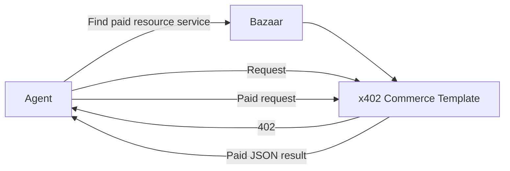

# Bazaar Discovery

Three names are easy to conflate:

| Component | Responsibility |
| --- | --- |
| x402 | Describes how HTTP resources request and prove payment |
| Facilitator | Verifies the payment and settles it on Algorand |
| Bazaar | Catalogs machine-readable paid-resource metadata |



## Configuration

[src/x402/config.ts](../src/x402/config.ts) registers `bazaarResourceServerExtension` once and attaches a declared discovery extension to the protected route. The default metadata describes the sample wallet route; custom projects should replace it with their real paid resource. The declaration contains:

- a specific human- and machine-readable resource description;
- an example input and validation-oriented input schema;
- an example output result;
- `extra.tag = x402-global-challenge` when `CHALLENGE_MODE=true`.

The extension is carried in the `402` and copied into the paid payload. GoPlausible can catalog it when settlement traffic passes through the facilitator.

## Verify Locally Configured Metadata

Run x402 Commerce Template, then request a valid address without payment:

```bash
pnpm client:unpaid
```

This proves the resource is configured and emits payment requirements. It does **not** prove that Bazaar indexed it.

## Verify Live Discovery

1. Deploy x402 Commerce Template at a public HTTPS URL.
2. Complete a real paid request through GoPlausible on the intended network.
3. Open the [GoPlausible resource catalog](https://facilitator.goplausible.xyz/dashboard/leaderboards?cat=resources).
4. Search/filter for your deployed resource and inspect its description, URL, payment options, input, and output metadata.
5. Run the programmatic check:

   ```bash
   AGENT_DISCOVERY=bazaar pnpm client:agent
   ```

The agent uses the official Bazaar client extension to query GoPlausible's discovery resources. It searches returned URL/metadata for x402 Commerce Template or paid resource and refuses to claim discovery when no match exists.

## Why Agents Care

Without discovery, an agent must already know a URL. Bazaar lets it enumerate paid services and inspect their terms and shapes before paying. Discovery does not decide whether a service is trustworthy or whether the price is worthwhile; that remains agent policy.
