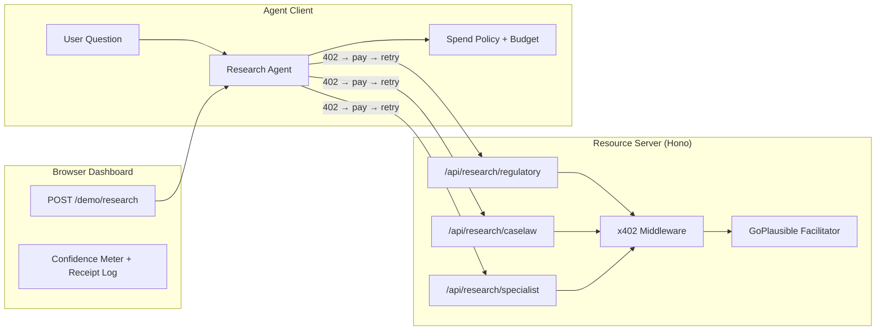

# "Ask Until Sure" — Confidence-Gated Research Agent

Build a multi-source research agent where each data source is an x402-gated paid endpoint. An orchestrating agent starts with a low-confidence guess, selectively pays for the sources whose expected confidence gain exceeds their price, and stops when confidence crosses a threshold or a budget cap is hit. The demo centerpiece is a live confidence meter + receipt log in the browser dashboard.

## Architecture Overview



## User Review Required

> [!IMPORTANT]
> **Pricing**: I'll set these prices for the three sources:
> - Regulatory filings lookup: **$0.10**
> - Case-law / precedent search: **$0.15**
> - Specialist Q&A: **$0.20**
> 
> These are low enough for TestNet demos but differentiated enough to make the cost-benefit tradeoff interesting.

> [!IMPORTANT]
> **Mock data sources**: Since this is a hackathon demo, the three endpoints will return mock but realistic regulatory/legal data (not real API calls). The confidence-gain logic is deterministic and simulated — each source contributes a fixed confidence delta based on the question category, making the demo reproducible.

> [!WARNING]
> **Single server model**: All three paid endpoints live on the same Hono server (same `PAY_TO_ADDRESS`), each at a different price. The demo agent on the server calls its own endpoints through the x402 flow (same pattern as the existing `demo.ts`). The CLI agent client also works standalone.

## Open Questions

1. **Default budget cap**: I'll default the agent's budget cap to **$1.00** and the confidence threshold to **85%**. The user can override both via the dashboard and via env vars. Does this feel right?
2. **Question categories**: I'll ship with two demo question categories (EU cosmetics regulation, FDA drug approval). Should I add more, or are two sufficient for the hackathon?

## Proposed Changes

### 1. Project Metadata & Brief

---

#### [MODIFY] [PROJECT_BRIEF.md](file:///c:/Users/Brijesh/Downloads/x402-commerce-template-main/PROJECT_BRIEF.md)
Fill in all fields: service name "Ask Until Sure", three paid routes, three prices, input/output schemas, buyer policy, Bazaar metadata.

#### [MODIFY] [package.json](file:///c:/Users/Brijesh/Downloads/x402-commerce-template-main/package.json)
Rename from `x402-commerce-template` to `ask-until-sure`.

#### [MODIFY] [README.md](file:///c:/Users/Brijesh/Downloads/x402-commerce-template-main/README.md)
Rewrite to describe the Ask Until Sure service: setup instructions, TestNet ALGO/USDC funding, ASA opt-in, three paid endpoints, the agent flow, and the dashboard.

#### [MODIFY] [.env.example](file:///c:/Users/Brijesh/Downloads/x402-commerce-template-main/.env.example)
Add `CONFIDENCE_THRESHOLD`, `BUDGET_CAP_USD`, rename `PRICE_USDC` references, keep all existing wallet/network vars.

---

### 2. Server Configuration

---

#### [MODIFY] [src/config.ts](file:///c:/Users/Brijesh/Downloads/x402-commerce-template-main/src/config.ts)
- Remove the single `price` field; add `prices: { regulatory: string, caselaw: string, specialist: string }`.
- Remove `defaultWalletAddress` (no longer relevant).
- Add `confidenceThreshold: number` and `budgetCapUsd: number`.

#### [MODIFY] [src/server.ts](file:///c:/Users/Brijesh/Downloads/x402-commerce-template-main/src/server.ts)
Update console log to say "Ask Until Sure" and list the three protected endpoints.

---

### 3. Paid Research Endpoints (Business Logic)

---

#### [NEW] [src/services/research.ts](file:///c:/Users/Brijesh/Downloads/x402-commerce-template-main/src/services/research.ts)
Mock research service with three methods:
- `queryRegulatoryFilings(question: string)` — returns regulatory data + confidence contribution
- `queryCaseLaw(question: string)` — returns case-law results + confidence contribution
- `querySpecialist(question: string)` — returns expert opinion + confidence contribution

Each returns `{ findings: string[], confidenceDelta: number, source: string }`. The mock data is category-aware (parses keywords to return relevant mock results).

#### [NEW] [src/routes/research.ts](file:///c:/Users/Brijesh/Downloads/x402-commerce-template-main/src/routes/research.ts)
Three Hono handler factories:
- `createRegulatoryHandler(service)` → `GET /api/research/regulatory?q=...`
- `createCaseLawHandler(service)` → `GET /api/research/caselaw?q=...`
- `createSpecialistHandler(service)` → `GET /api/research/specialist?q=...`

Each validates the `q` query parameter (non-empty, max 500 chars) and returns the findings + settlement transaction ID from the response header.

#### [DELETE] [src/routes/wallet.ts](file:///c:/Users/Brijesh/Downloads/x402-commerce-template-main/src/routes/wallet.ts)
Remove the default wallet endpoint.

#### [DELETE] [src/services/algorand.ts](file:///c:/Users/Brijesh/Downloads/x402-commerce-template-main/src/services/algorand.ts)
Remove the Algorand indexer service (no longer used).

---

### 4. x402 Payment Middleware

---

#### [MODIFY] [src/x402/config.ts](file:///c:/Users/Brijesh/Downloads/x402-commerce-template-main/src/x402/config.ts)
Register three protected routes with differentiated prices:
```
'GET /api/research/regulatory' → $0.10
'GET /api/research/caselaw'    → $0.15
'GET /api/research/specialist' → $0.20
```
Each with its own Bazaar discovery metadata (description, input schema `{ q: string }`, output example).

---

### 5. App Wiring

---

#### [MODIFY] [src/app.ts](file:///c:/Users/Brijesh/Downloads/x402-commerce-template-main/src/app.ts)
- Remove old wallet route and validation middleware.
- Add query-parameter validation middleware for all three `/api/research/*` routes (reject empty `q` before x402).
- Wire the three research handlers.
- Update health endpoint service name.
- Wire new demo route `/demo/research`.

---

### 6. Demo Agent (Server-Side)

---

#### [MODIFY] [src/routes/demo.ts](file:///c:/Users/Brijesh/Downloads/x402-commerce-template-main/src/routes/demo.ts)
Replace the single-purchase demo with a **multi-step research agent flow**:
1. Accept `{ question: string, budgetCap?: number, confidenceThreshold?: number }`.
2. Start with a base confidence from "general knowledge" (~30%).
3. Loop through sources ordered by expected value (confidence delta / price):
   - Check spend policy: skip if remaining budget < source price.
   - Call the x402-protected source endpoint (402 → pay → retry).
   - Record receipt: `{ source, price, txId, confidenceBefore, confidenceAfter, reason }`.
   - If confidence ≥ threshold, stop.
4. Return `{ answer, confidence, receipts[], totalCost, sourcesUsed, sourcesSkipped, question }`.

---

### 7. Browser Dashboard

---

#### [MODIFY] [src/web/page.ts](file:///c:/Users/Brijesh/Downloads/x402-commerce-template-main/src/web/page.ts)
Completely redesign the HTML for "Ask Until Sure":
- **Hero section**: "Ask a hard question. Watch the agent pay for certainty."
- **Input form**: Question text area + budget cap slider + confidence threshold slider.
- **Live confidence meter**: Animated arc/bar that fills as confidence climbs.
- **Receipt log**: Scrolling list showing each source queried, its cost, confidence gain, and why the agent chose it.
- **Final summary card**: Total cost, final confidence, answer, sources used vs. skipped.
- **Payment activity steps**: Challenge → Evaluate sources → Pay source N → Settle → Confidence check → Answer.

#### [MODIFY] [src/web/app-script.ts](file:///c:/Users/Brijesh/Downloads/x402-commerce-template-main/src/web/app-script.ts)
Rewrite the client-side JS to:
- Submit the question + settings to `/demo/research`.
- Use **Server-Sent Events (SSE)** or a single POST with streaming response to show step-by-step progress.
  - *Decision*: Since the demo handler calls multiple x402 endpoints sequentially, I'll use a **single POST** that returns the full result, then animate the receipt log entries one by one on the client using `setTimeout` delays. This is simpler and avoids SSE complexity while still giving the "live" feel.
- Animate the confidence meter bar growing with each receipt.
- Show running cost accumulation.

#### [MODIFY] [src/web/styles.ts](file:///c:/Users/Brijesh/Downloads/x402-commerce-template-main/src/web/styles.ts)
Redesign CSS for:
- Confidence meter (animated gradient arc).
- Receipt log cards with source icons and cost badges.
- Summary panel with total cost highlight.
- Keep the existing design system (dark navy, green accents, monospace labels) but adapt for the new layout.

---

### 8. Client Library & CLI Clients

---

#### [MODIFY] [client/lib.ts](file:///c:/Users/Brijesh/Downloads/x402-commerce-template-main/client/lib.ts)
- Update `resourceUrl()` to return the base URL (no more wallet address in path).
- Add `researchEndpoints(baseUrl)` returning the three endpoint URLs.
- Add `SpendPolicy` interface: `{ dailyBudget: number, maxPerRequest: number, allowedServices: string[], blockedServices: string[] }`.
- Add `shouldPay(requirement, policy, spentSoFar)` function.

#### [MODIFY] [client/paid-client.ts](file:///c:/Users/Brijesh/Downloads/x402-commerce-template-main/client/paid-client.ts)
Rewrite as a single-source paid client: calls one research endpoint, pays, prints receipt.

#### [MODIFY] [client/agent-client.ts](file:///c:/Users/Brijesh/Downloads/x402-commerce-template-main/client/agent-client.ts)
Rewrite as the **confidence-gated research agent CLI**:
- Takes a question from env/args.
- Implements the full loop: base guess → evaluate sources → pay selectively → stop at threshold/budget.
- Prints the confidence meter (text-based) and receipt table.
- Uses spend policy from env vars.

#### [MODIFY] [client/unpaid-client.ts](file:///c:/Users/Brijesh/Downloads/x402-commerce-template-main/client/unpaid-client.ts)
Update to call one of the three research endpoints and show the 402 response.

---

### 9. Tests

---

#### [MODIFY] [test/config.ts](file:///c:/Users/Brijesh/Downloads/x402-commerce-template-main/test/config.ts)
Update `testConfig` with the new `prices` object, `confidenceThreshold`, `budgetCapUsd`, and remove `defaultWalletAddress`.

#### [MODIFY] [test/app.test.ts](file:///c:/Users/Brijesh/Downloads/x402-commerce-template-main/test/app.test.ts)
Rewrite tests:
- Health endpoint returns `ask-until-sure` service name.
- Dashboard renders the new UI text.
- Invalid query (empty `q`) returns 400 before payment.
- Valid unpaid request returns 402 with `payment-required` header for each of the three endpoints.
- Demo agent disabled by default (403).
- Challenge mode tag test adapted for new routes.

#### [MODIFY] [test/algorand.test.ts](file:///c:/Users/Brijesh/Downloads/x402-commerce-template-main/test/algorand.test.ts)
Replace with **research service unit tests**:
- Each mock source returns expected structure.
- Confidence deltas are in valid range (0–1).
- Question parsing returns relevant findings.

---

### 10. Scripts & Smoke Test

---

#### [MODIFY] [scripts/smoke.ts](file:///c:/Users/Brijesh/Downloads/x402-commerce-template-main/scripts/smoke.ts)
Update to hit `/health` and all three `/api/research/*` endpoints, expecting 402 on each.

---

### 11. SDK Extensions

---

#### [MODIFY] [sdk/extensions.ts](file:///c:/Users/Brijesh/Downloads/x402-commerce-template-main/sdk/extensions.ts)
Add the `SpendPolicy` interface with budget tracking and the `evaluateSourceValue(confidenceDelta, price)` utility that computes expected value per dollar.

---

## File Change Summary

| Action | File | What Changes |
|--------|------|-------------|
| MODIFY | `PROJECT_BRIEF.md` | Fill with Ask Until Sure details |
| MODIFY | `package.json` | Rename to `ask-until-sure` |
| MODIFY | `README.md` | Full rewrite for new service |
| MODIFY | `.env.example` | Add confidence/budget vars |
| MODIFY | `src/config.ts` | Multi-price config, new fields |
| MODIFY | `src/server.ts` | New service name and endpoints |
| NEW | `src/services/research.ts` | Mock research data sources |
| NEW | `src/routes/research.ts` | Three paid route handlers |
| DELETE | `src/routes/wallet.ts` | Remove old route |
| DELETE | `src/services/algorand.ts` | Remove old service |
| MODIFY | `src/x402/config.ts` | Three routes, three prices, new Bazaar metadata |
| MODIFY | `src/app.ts` | Wire new routes, validation, demo |
| MODIFY | `src/routes/demo.ts` | Multi-step research agent |
| MODIFY | `src/web/page.ts` | New dashboard HTML |
| MODIFY | `src/web/app-script.ts` | Animated confidence meter + receipts |
| MODIFY | `src/web/styles.ts` | New CSS for research UI |
| MODIFY | `client/lib.ts` | Research endpoints, spend policy |
| MODIFY | `client/paid-client.ts` | Single-source research client |
| MODIFY | `client/agent-client.ts` | Confidence-gated agent CLI |
| MODIFY | `client/unpaid-client.ts` | Updated for research route |
| MODIFY | `test/config.ts` | New test config shape |
| MODIFY | `test/app.test.ts` | Tests for new routes |
| MODIFY | `test/algorand.test.ts` → `test/research.test.ts` | Research service tests |
| MODIFY | `scripts/smoke.ts` | Smoke against three endpoints |
| MODIFY | `sdk/extensions.ts` | Spend policy + value evaluation |

## Verification Plan

### Automated Tests
```bash
pnpm build        # TypeScript compilation
pnpm test         # Vitest unit tests
pnpm smoke        # Health + 402 on all three endpoints
pnpm simulate     # Payment flow simulation
```

### Manual Verification
- Start `pnpm dev` and open `http://localhost:3000`
- Enter a question, set budget/threshold, click "Research"
- Verify confidence meter animates, receipts appear step-by-step, total cost shown
- With `DEMO_MODE=true` + `CLIENT_MNEMONIC`, verify real x402 402→pay→settle→200 flow
- Run `pnpm client:agent` for CLI agent with spend policy
